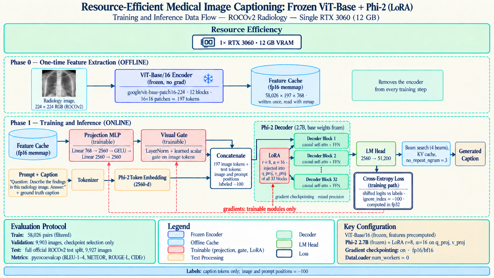

# Resource-Efficient Medical Image Captioning with ViT-Base and Phi-2 (LoRA)

A radiology captioning system trained end to end on **one consumer GPU: an RTX 3060 with 12 GB of VRAM**. A frozen ViT-Base encoder feeds Microsoft Phi-2 (2.7B) through a small projection network, and Phi-2 is adapted with LoRA. Only **11.15M parameters train, 0.39% of the 2.88B in the full system**, and training peaks at **8.56 GiB of VRAM**.

The point of the project is the budget. Most published ROCOv2 captioning systems train on multi-GPU clusters or data-centre cards. This one runs on a card a student can buy.

| | |
|---|---|
| GPU | 1× NVIDIA RTX 3060, 12 GB |
| Peak VRAM (training) | 8.56 GiB |
| Trainable parameters | 11.15M (8.53M projection + 2.62M LoRA) |
| Frozen parameters | ViT-Base/16 85.8M, Phi-2 2.78B |
| Training time | ~25.5 h (~26.6 h including per-epoch validation) |
| Encoder cost during training | zero: features precomputed once |
| Test set | full official ROCOv2 test split, 9,927 images |

---

## Architecture

Training runs in two parts.

**Stage 0, offline and one-time.** Every ROCOv2 image goes through a frozen ViT-Base/16 (`google/vit-base-patch16-224`, no pooler) once. The 197 × 768 patch embeddings land in an fp16 memory-mapped cache, 58,026 × 197 × 768 for the training split (about 17.6 GB on disk). From then on the encoder never runs during training: each step reads its features straight from disk through `np.load(mmap_mode="r")`. This one change removes 86M parameters of forward compute from every training step.

**Stage 1, online.** Cached features pass through a trainable projection (Linear 768→2560, GELU, Linear 2560→2560, LayerNorm) and a learned scalar gate. The 197 visual tokens are prepended to the tokenized prompt and caption, then fed to Phi-2. Phi-2's base weights stay frozen; LoRA (r=8, α=16, dropout 0.05) sits on `q_proj` and `v_proj` in all 32 decoder blocks. Image and prompt positions carry label −100, so the cross-entropy covers caption tokens only.

### What keeps it inside 12 GB

| Measure | Effect |
|---|---|
| Offline ViT feature cache | encoder weights and activations never touch the training step |
| Frozen Phi-2 + LoRA on q/v only | 2.62M adapter parameters instead of 2.78B |
| SDPA attention (eager rejected at load time) | no retained (B, H, T, T) score matrix per layer |
| Gradient checkpointing in both stages (`use_reentrant=False`) | activations recomputed instead of stored across 32 layers |
| Loss computed on gathered caption positions before the fp32 upcast | avoids upcasting the full (B, T, 51,200) logit tensor, roughly 250 MB per micro-batch |
| bf16 autocast where supported, fp16 + GradScaler otherwise | half-precision activations |
| Micro-batch 4 × gradient accumulation 8 | effective batch 32 on a 12 GB card |
| `expandable_segments` CUDA allocator | less fragmentation near the memory cap |

### Two-stage training

Joint single-stage training collapsed in earlier versions: the decoder learned to lower the loss from caption statistics alone before the projection learned to carry any visual signal, and the gate drifted toward zero. v5 splits the schedule:

- **Stage A (2 epochs).** Projection only, lr 1e-3. Phi-2 fully frozen, no LoRA. The gate starts at 1.0 and stays frozen, so the model cannot learn to mute the image.
- **Stage B (3 epochs).** LoRA attached (lr 5e-5), projection continues at lr 2e-4, gate becomes trainable. The optimizer and cosine schedule are rebuilt from scratch so Stage A's momentum does not carry into LoRA.

AdamW (β = 0.9, 0.95), weight decay 0.01, 3% warmup, gradient clipping at 1.0, label smoothing 0.05, seed 0.

### Integrity gates

The v4 collapse traced back to cached feature rows that did not match their captions. v5 refuses to train until alignment is proven:

1. The cache and a row-order manifest are written together, atomically, and tagged with a `cache_sig` hash. Any mismatch hard-fails.
2. 32 random images are re-encoded through the ViT and must match their cached rows at cosine > 0.995, with an explicit off-by-one check.
3. The projection must overfit 8 images and recover their captions before the real run starts. (It passed: 7/8 captions recovered, loss 3.90 → 0.29, gate rose from 1.00 to 1.14.)

---

